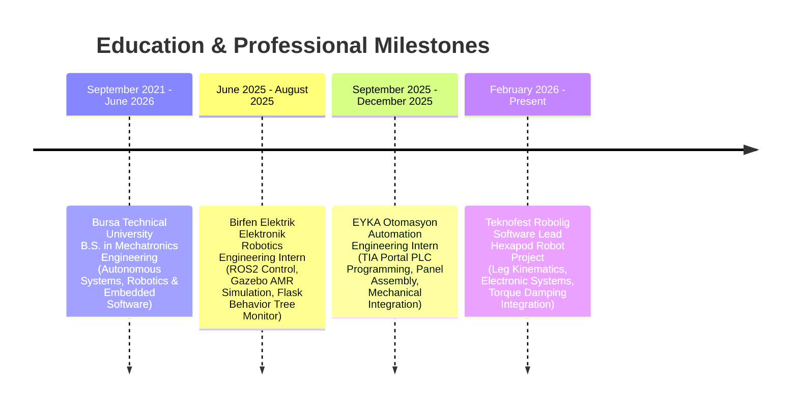

# Hi there, I'm Furkan Karslı! 👋
### Mechatronics Engineer | ROS2 Robotics & Distributed IoT Developer

  
  

---

## 🚀 About Me

I am a **Mechatronics Engineer** specializing in autonomous mobile robots (AMRs), robotic software architectures, and smart IoT ecosystems. My expertise lies at the intersection of hardware-software integration, control theory, and web interface visualization:

- **Robotics (ROS2)**: Experienced in designing modular software nodes, mission state machines (SMACH), behavior trees (`py_trees`), SLAM mapping, and sensor synchronization (LIDAR, IMU, encoders).
- **Embedded & IoT**: Designing secure, distributed IoT systems using ESP32, ESP-12E, and Raspberry Pi, communicating via UDP broadcast and authenticated REST HTTP APIs.
- **Web Dashboards & DSP**: Developing responsive interfaces (Flask, WebSockets) to visualize real-time sensor streams and robot state execution, as well as browser-based digital signal processing (Web Audio API).

---

## 🛠️ Tech Stack & Skills

<table>
  <tr>
    <td valign="top" width="50%">
      <h4>💻 Languages & Software</h4>
      
      
      
      
      
      
      
    </td>
    <td valign="top" width="50%">
      <h4>🤖 Robotics & Systems</h4>
      
      
      
      
      
    </td>
  </tr>
  <tr>
    <td valign="top" width="50%">
      <h4>🔌 Hardware & Engineering</h4>
      
      
      
      
      
    </td>
    <td valign="top" width="50%">
      <h4>🌐 Web & Web-DSP</h4>
      
      
      
      
    </td>
  </tr>
</table>

## 🌟 Featured Projects

### 1. [AMR Forklift Simulation & Autonomy (amr_forklift)](https://github.com/furkankarsli/amr_forklift)
An industry-standard ROS2 simulation and autonomy package for the **Nebula Forklift AMR**, featuring physics-based Gazebo integration and a safety-critical behavior tree.
- **Core Features**:
  - **Autonomy Behavior Tree**: Implemented using `py_trees` to monitor battery, manage automatic docking/charging states, and handle emergency safety stops.
  - **AMR Forklift URDF**: Customized forklift geometry with prismatic joints (`lift_joint`) and parameterized passive rollers.
  - **Nebula Arena**: Custom simulated world environment in Gazebo with multiple path networks.
- **Tech Stack**: `ROS2 (Humble)`, `Python (py_trees)`, `Xacro (URDF)`, `Gazebo`, `RViz2`.

### 2. [Distributed Industrial IoT Ecosystem](https://github.com/furkankarsli/fkstech-iot)
A multi-node telemetry system for industrial monitoring and automation control.
- **Architecture**:
  - **Telemetry Nodes**: ESP-12E microcontrollers reading MQ-Gas, Flame, Temperature, and Humidity sensors, broadcasting UDP packets.
  - **Central Gateway**: An ESP32 system (programmed in native ESP-IDF C using FreeRTOS) that handles UDP broadcasts and sends secure HTTP POST requests to the cloud.
  - **Cloud Dashboard**: A Python Flask web server connected to a SQLite database displaying real-time sensor streams and controlling local actuators (Relays, OLED display mode, alarm LEDs).
- **Tech Stack**: `ESP-IDF (C)`, `Arduino (C++)`, `FreeRTOS`, `Python (Flask)`, `SQLite`, `UDP/HTTP REST`.

### 3. [Signal Lab & Frequency Synthesizer](https://github.com/furkankarsli/ses)
An advanced client-side web synthesizer for generating audio frequencies and binaural/monaural wave entrainment structures.
- **Core Engine**: Implements a complete DSP graph using the Web Audio API with multi-oscillator modulation, dynamic stereo panning, and automatic clipping prevention via gain scheduling and compressor nodes.
- **Offline Rendering**: Utilizes `lamejs` and `OfflineAudioContext` to synthesize and encode custom frequency paths into high-quality MP3s directly in the browser.
- **Tech Stack**: `Vanilla JavaScript`, `Web Audio API (DSP)`, `HTML5 Canvas (Oscilloscope)`, `CSS3`.

### 4. [ROS2 Behavior Tree Autonomy Tutorial Workspace](./git_ros2_ws)
A robust ROS2 workspace implementing basic robot autonomy architectures using Behavior Trees and State Machines.
- **Packages**:
  - `robot_bt`: Custom C++ and Python executor managing action servers (`CleanArea.action`), cmd_vel publishers, and simulated battery/distance sensors.
  - `turtle_tasks`: Runs optimized Nav2 parameters (`nav2_params_optimized.yaml`) for differential drive AMRs executing complex BT tasks.
  - `turtlebot_autonomy`: Automates high-level missions using the SMACH state machine framework.
  - `SimpleExamplesForBehaviorTree`: Teaches the basics of `behaviortree_cpp`, `smach`, and `py_trees`.
- **Tech Stack**: `ROS2 (Humble)`, `Python`, `C++`, `Behavior Trees`, `SMACH`, `Nav2`, `Gazebo`.

---

## 💼 Experience & Education

---

## 📫 Let's Connect!

- 👔 **LinkedIn**: [linkedin.com/in/furkankarsli](https://linkedin.com/in/furkankarsli)
- ✉️ **Email**: [furknkrsli@gmail.com](mailto:furknkrsli@gmail.com)
