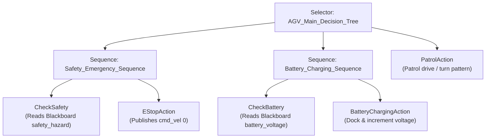

# Nebula AGV Autonomy & Simulation Package 🤖📦

An industry-standard ROS2 Humble simulation and robot autonomy package designed for the **Nebula Forklift AGV**. This package features physics-based Gazebo integration, sensor fusion models, and a modular **Behavior Tree (py_trees)** node managing emergency safety protocols, automated charging states, and devriye (patrol) patterns.

---

## 📐 Behavior Tree Structure

The robot's decision-making is governed by a modular Behavior Tree. The hierarchy checks emergency safety first, then low-battery states, and defaults to the patrol mission:



---

## 🛠️ Features

* **Nebula Forklift AGV Model**: Physics-calibrated differential drive chassis featuring a functional prismatic fork mechanism (`lift_joint`) and parameterized caster wheels for high-fidelity Gazebo representation.
* **Nebula Arena World**: A Gazebo-simulated obstacle track featuring corridors, wall segments, and navigation testing environments.
* **Interactive Behavior Tree Node (`agv_behavior_tree`)**:
  * **Safety E-Stop**: Subscribes to `/safety_hazard` (triggered by simulated gas/temperature threshold checks). Stops the AGV instantly.
  * **Auto-Charging State**: Subscribes to `/battery_voltage`. Under low voltage (<= 11.0V), patrol is suspended, and the robot enters charging mode. Once simulated charging reaches 14.2V+, patrol resumes.
  * **Patrol Mission**: Executes automated navigation commands (alternate linear drive and angular turns) publishing to `/cmd_vel`.
* **Standardized Modern Launch Description**: Uses modern ROS2 APIs and arguments to configure nodes and load Gazebo assets cleanly.

---

## 📂 Directory Structure

```
agv_autonomy/
├── package.xml            # Package manifest (dependencies: rclpy, py_trees, etc.)
├── CMakeLists.txt         # Build configurations & action compilation
├── action/
│   └── PlayAudio.action   # Custom action interfaces for speech/warning alarms
├── launch/
│   ├── gazebo.launch.py   # Launches Gazebo world, Spawner, and Robot State Publisher
│   └── behaviors.launch.py# Launches the Behavior Tree autonomy node
├── worlds/
│   └── nebula_arena.world # Gazebo world environment
├── models/
│   └── nebula_urdf/       # AGV robot model (model.xacro, joints, materials, meshes)
├── rviz/
│   └── config.rviz        # Preconfigured RViz environment config
└── agv_autonomy/
    ├── __init__.py
    └── agv_behavior_tree.py# Autonomy node running the Blackboard & py_trees tick loop
```

---

## ⚙️ How to Build & Run

### 1. Build the Workspace
Ensure ROS2 Humble is sourced, then build the package:
```bash
cd <your_ros2_ws_root>
colcon build --packages-select agv_autonomy --symlink-install
source install/setup.bash
```

### 2. Launch Gazebo Simulation
Starts the physics world, spawns the Nebula AGV, and runs RViz2 for sensor visualization:
```bash
ros2 launch agv_autonomy gazebo.launch.py
```

### 3. Start Autonomy Behavior Tree Node
Starts the mission and safety loop:
```bash
ros2 launch agv_autonomy behaviors.launch.py
```

### 4. Simulating Events (Manual Override)
Publish to safety or battery topics to observe the Behavior Tree react dynamically:
* **Trigger Safety Hazard (E-Stop)**:
  ```bash
  ros2 topic pub /safety_hazard std_msgs/Bool "{data: true}" -1
  ```
* **Trigger Low Battery (Force Charge)**:
  ```bash
  ros2 topic pub /battery_voltage std_msgs/Float32 "{data: 10.5}" -1
  ```
